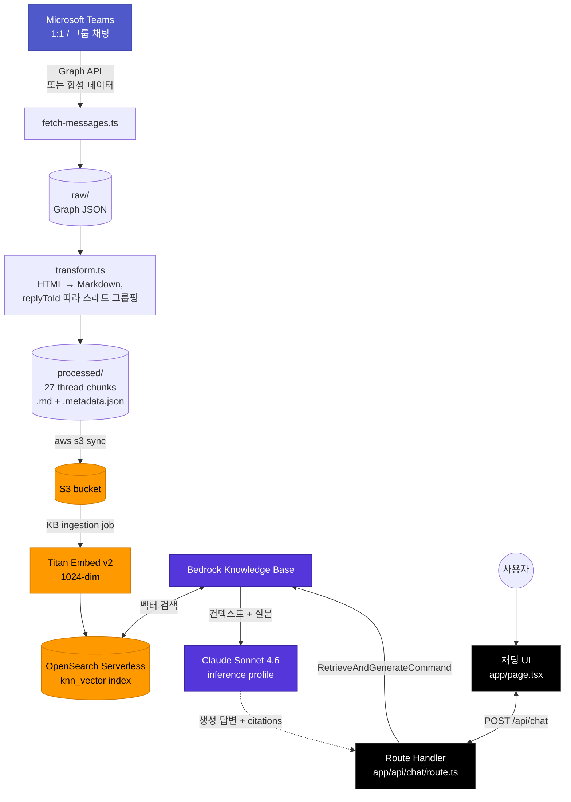
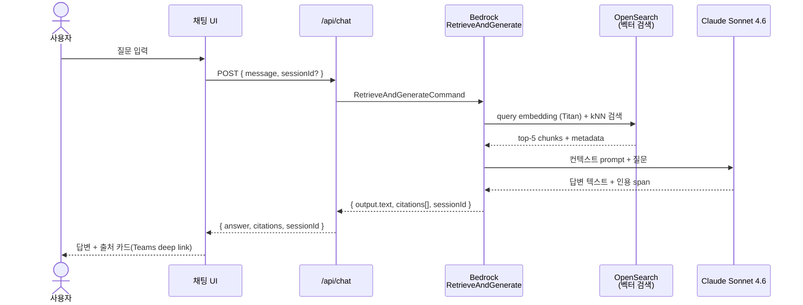

# Teams × Amazon Bedrock KB 챗봇

Microsoft Teams 대화 이력을 Amazon Bedrock Knowledge Base 에 적재하고,
Next.js + TypeScript 챗봇으로 질의응답하는 PoC.

---

## 아키텍처



### 요청 흐름 (RAG 한 사이클)



---

## 빠른 시작

전제: AWS 자원이 이미 배포돼 있고 (`setup-kb.sh` 실행 완료) `web/.env.local` 이 채워진 상태.

```bash
cd web/
npm install     # 최초 1회
npm run dev     # http://localhost:3000
```

브라우저로 <http://localhost:3000> → 샘플 질문 칩 클릭으로 즉시 시연.

---

## 진행 상태 (4단계 모두 완료)

| Step | 산출물 | 문서 |
|---|---|---|
| 1. Teams export | Graph 토큰 또는 합성 데이터 → `ingestion/raw/messages_*.json` | [01-Graph Explorer](docs/01-teams-export-guide.md) / [01b-브라우저 토큰](docs/01b-browser-token-method.md) |
| 2. 변환 | `transform.ts` → 27 thread chunks (Markdown + 메타데이터) | (코드 자체) |
| 3. AWS 셋업 | S3 + IAM + OSS + Bedrock KB + Data Source + Ingestion | [02-콘솔](docs/02-aws-console-setup.md) / [02b-CLI 자동화](docs/02b-aws-cli-setup.md) |
| 4. Next.js 챗봇 | App Router + `/api/chat` + 채팅 UI + 인용 표시 | [web/README](web/README.md) |
| 5a. Teams Outgoing Webhook (deprecated) | `/api/teams/webhook` — HMAC | [03-Teams Webhook](docs/03-teams-webhook-setup.md) |
| 5b. Teams Power Automate Workflow | `/api/teams/automate` — 헤더 인증 (MS 권장 대체재) | [04-Power Automate](docs/04-power-automate-setup.md) |

---

## 디렉토리 구조

```
.
├── ingestion/
│   ├── raw/                  # Graph JSON 원본 (3 채팅 = 42 메시지)
│   ├── processed/            # KB 업로드용 .md + .metadata.json (54 파일 = 27 쌍)
│   ├── aws/
│   │   ├── setup-kb.sh       # AWS 자원 일괄 생성 (S3, IAM, OSS, KB, ingestion)
│   │   ├── teardown-kb.sh    # 역순 정리
│   │   └── create-oss-index.ts  # OSS 벡터 인덱스 생성 (CLI로 불가능한 부분)
│   ├── fetch-messages.ts     # Graph API 토큰 기반 채팅 수집
│   ├── transform.ts          # raw → processed 변환
│   └── package.json
├── web/
│   ├── app/
│   │   ├── api/chat/route.ts # RetrieveAndGenerate 핸들러
│   │   ├── page.tsx          # 채팅 UI
│   │   ├── layout.tsx
│   │   └── globals.css
│   ├── lib/types.ts          # Citation, ChatMessage, ChatResponse
│   ├── .env.local.example
│   └── package.json
├── docs/                     # 단계별 가이드 (한국어)
└── README.md
```

---

## 핵심 결정사항

| 항목 | 값 | 근거 |
|---|---|---|
| Teams 데이터 범위 | 1:1 / 그룹 채팅 | 관리자 동의 없이 가능한 범위 |
| 데이터 수집 방식 | 합성 데이터 (Graph Explorer 차단됨) | 회사 테넌트에서 `Chat.Read` 스코프 차단 |
| 청킹 | thread 단위 (transform.ts) + KB `chunkingStrategy: NONE` | replyToId 따라 의미 단위 보존 |
| AWS 리전 | us-west-2 | Bedrock 신모델 가장 먼저 들어오는 리전 |
| 벡터 스토어 | OpenSearch Serverless (Quick Create) | Bedrock KB 마법사 기본. 시간당 ~$0.48 |
| 임베딩 모델 | Amazon Titan Text Embeddings v2 (1024-dim, multilingual) | 한국어 지원 |
| 생성 모델 | Claude Sonnet 4.6 (`us.anthropic.claude-sonnet-4-6` inference profile) | on-demand 미지원이라 inference profile 사용 |
| 응답 방식 | Bedrock RetrieveAndGenerate (한 방) | 검색 + 생성 + 인용 자동 |
| 세션 관리 | Bedrock `sessionId` 패스 | 약 24시간 컨텍스트 유지 |

---

## 시연 가능한 질문 (합성 데이터 기준)

| 질문 | 기대 답변 | 출처 |
|---|---|---|
| Phoenix 프로젝트 DB는 뭘 쓰기로 했어? | PostgreSQL (Aurora 호환) | phoenix__thread-002, 005 |
| Phoenix 릴리즈 일정 알려줘 | 코드 프리즈 6/5, 베타 6/15, GA 7/1 | phoenix__thread-008 |
| 고객사 A의 Bedrock 비용은 어떻게 줄였어? | 프롬프트 캐싱 + Haiku 라우팅, 약 65% 절감 | customer_a__thread-004, 006 |
| SAA 자격증 준비 기간 추천은? | 백엔드 경험 시 8주, 주 10~12시간 | mentor_1on1 |
| Bedrock 워크숍 일정과 내용은? | 6월 셋째 주, 3시간 (Bedrock 기초/KB/챗봇 데모) | mentor_1on1 |

---

## 배포된 AWS 자원 위치

자원 ID/이름은 SSM Parameter Store `/teams-bedrock-chatbot/*` 에 보관됩니다. 본인 환경에서 조회:

```bash
aws ssm get-parameters-by-path \
  --region us-west-2 \
  --path /teams-bedrock-chatbot \
  --query 'Parameters[].[Name,Value]' --output table
```

| Parameter | 의미 |
|---|---|
| `/teams-bedrock-chatbot/kb-id` | Bedrock Knowledge Base ID |
| `/teams-bedrock-chatbot/data-source-id` | KB Data Source ID |
| `/teams-bedrock-chatbot/collection-id` | OpenSearch Serverless 컬렉션 ID |
| `/teams-bedrock-chatbot/bucket` | S3 데이터 버킷 |
| `/teams-bedrock-chatbot/region` | 리전 |
| `/teams-bedrock-chatbot/model-id` | 생성 모델 (inference profile ID) |

Next.js 챗봇은 위 값들을 자동으로 SSM 에서 로드합니다. `web/.env.local` 에는 `AWS_REGION` 만 명시하면 충분.

---

## 정리 (Teardown)

> ⚠️ OSS Serverless 컬렉션이 ACTIVE 상태일 동안 시간당 약 $0.48 (월 환산 ~$345) 과금됩니다.
> 데모가 끝나면 반드시 아래 명령으로 정리하세요.

```bash
cd ingestion/
./aws/teardown-kb.sh
```

→ KB → OSS Collection → IAM role → S3 bucket 순서로 삭제. `delete` 입력으로 확인.

---

## Tech Stack

- **Language**: TypeScript (ingestion + web 양쪽)
- **Frontend**: Next.js 14 (App Router) + React 18 + Tailwind CSS 3
- **Backend**: Next.js Route Handler (Node.js runtime)
- **AWS SDK**: `@aws-sdk/client-bedrock-agent-runtime` v3
- **OpenSearch**: `@opensearch-project/opensearch` (AWS SigV4 서명, `aoss` 서비스)
- **Runtime**: Node.js 22 / npm 10

## 트러블슈팅

| 증상 | 원인 / 해결 |
|---|---|
| `/api/chat` → 500 `KB_ID is not set` | `web/.env.local` 누락. 서버 재시작 필요 |
| `ValidationException: model ARN` | 모델 ID 형식 오류 또는 EOL 모델. `aws bedrock list-foundation-models` 로 ACTIVE 확인 |
| `Invocation ... with on-demand isn't supported` | inference profile 필요. `MODEL_ID=us.anthropic.claude-...` + `AWS_ACCOUNT_ID=...` |
| `AccessDeniedException` | 로컬 IAM에 `bedrock:RetrieveAndGenerate`, `bedrock:InvokeModel` 권한 부족 |
| 답변은 나오는데 citations 비어있음 | KB 인덱싱 실패. `aws bedrock-agent list-ingestion-jobs ...` 로 status 확인 |
| `aws opensearchserverless ... AccessDenied` (인덱스 생성 시) | OSS data access policy 의 Principal 에 본인 ARN 누락. setup-kb.sh 가 자동 추가하지만 수동 시 본인 IAM ARN 추가 필요 |

자세한 단계별 가이드는 `docs/` 아래 문서들을 참고.
