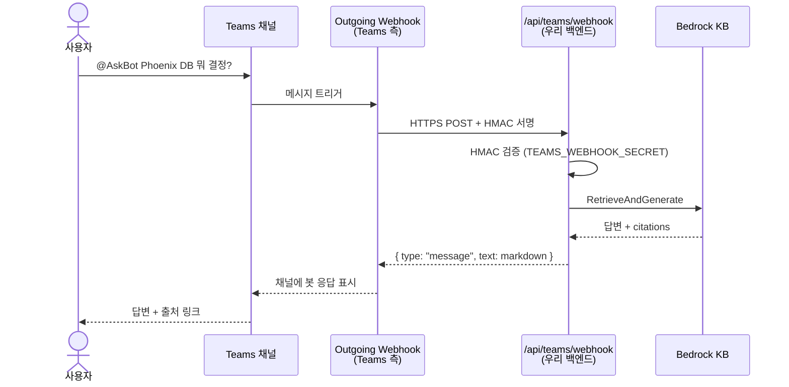

# Teams Outgoing Webhook 연동 가이드

> 본인 Teams 채널에서 `@AskBot 질문` 형태로 즉시 챗봇을 호출할 수 있게 만드는 가장 가벼운 통합. 채널 owner 권한만으로 가능하며 회사 IT 승인 없이 진행.

---

## 작동 흐름



---

## ⚠️ 제약사항 먼저

| 제약 | 내용 |
|---|---|
| **5초 응답 타임아웃** | Teams 가 응답을 5초 안에 못 받으면 에러. Bedrock 답변이 길면 종종 timeout. 데모용 OK, production 아님. |
| **채널 전용** | 1:1 DM 불가. 봇은 추가한 채널 안에서 `@mention` 으로만 호출. |
| **채널마다 등록** | 여러 채널 쓰려면 각 채널에 따로 webhook 추가 (같은 secret 재사용 가능) |
| **공개 HTTPS endpoint 필요** | localhost 직접 불가. 로컬 테스트는 ngrok / cloudflared, production 은 ALB URL |
| **Bot Framework 봇과 다름** | 더 정교한 UX (proactive message, DM, 다중 채널) 원하면 옵션 C 로 |

---

## 1. 공개 HTTPS endpoint 준비

로컬 개발 중이면 ngrok 으로 터널:

```bash
# 별도 터미널에서
brew install ngrok    # 최초 1회
ngrok config add-authtoken <your-ngrok-token>    # https://dashboard.ngrok.com/get-started/your-authtoken
ngrok http 3000
```

ngrok 출력에서 forwarding URL 확보:
```
Forwarding   https://xxxx-yyy-zzz.ngrok-free.app -> http://localhost:3000
```

이 URL + `/api/teams/webhook` 가 Teams 가 호출할 endpoint:
```
https://xxxx-yyy-zzz.ngrok-free.app/api/teams/webhook
```

> Production 배포 (옵션 D — ECS+ALB) 후에는 `https://<your-alb-domain>/api/teams/webhook` 사용.

---

## 2. Teams 채널에 Outgoing Webhook 추가

1. 채널 owner 권한이 있는 채널 진입
2. 채널 이름 옆 **`...`** (More options) → **"채널 관리" (Manage channel)** ※ 회사 정책상 이 메뉴가 안 보이면 팀 owner 한테 요청
3. **"커넥터" / "Connectors"** 또는 채널 우측 상단의 **`+`** → **"앱 추가" (Add app)**

실제 Outgoing Webhook 추가 경로 (Teams 버전마다 다름):

- **Classic Teams**: 채널 → `...` → "Connectors" → 검색 "Outgoing Webhook" → "Add"
- **New Teams**: 채널 → `...` → "Manage team" → "Apps" 탭 → "Create an outgoing webhook"
  또는 좌측 사이드 ⋯ → "Workflows / Apps" 에서 검색

**Outgoing Webhook 설정 폼:**

| 필드 | 값 |
|---|---|
| Name | `AskBot` (사용자가 @mention 할 이름) |
| Callback URL | `https://<your-domain>/api/teams/webhook` |
| Description | "Bedrock KB 기반 사내 Q&A" |
| Profile picture | (선택) 64x64 아이콘 업로드 |

**Create** 클릭 → Teams가 **Security token (HMAC 시크릿)** 을 한 번 보여줍니다. **이 시점에 반드시 복사**해 두세요 (재조회 불가).

```
Security token: xxxxxxxxxxxxxxxxxxxxxxxx....=
```

---

## 3. Security Token 을 백엔드에 등록

### 방법 A — SSM Parameter Store (권장, production)

```bash
aws ssm put-parameter \
  --region us-west-2 \
  --name "/teams-bedrock-chatbot/teams-webhook-secret" \
  --type SecureString \
  --value "<paste token here>" \
  --overwrite
```

`/api/teams/webhook` 가 자동으로 SSM 에서 가져옵니다 (`getWebhookSecret()` 의 fallback).

> IAM 권한: 챗봇 task role 에 `ssm:GetParameter` + 해당 SecureString 의 KMS `Decrypt` 권한 필요. 기본 AWS-managed key 쓰면 별도 KMS 권한 자동.

### 방법 B — 환경변수 (로컬 dev)

```bash
cd web/
echo 'TEAMS_WEBHOOK_SECRET=xxxxxxxxxxxxxxxxxxxxxxxx....=' >> .env.local
```

(주의: `.env.local` 은 gitignore 되지만 commit 안 되도록 늘 확인)

env 가 있으면 SSM 무시되고 env 가 우선.

---

## 4. dev server 재시작 + 테스트

```bash
cd web/
# 이미 dev 돌고 있으면 중단 후 재시작 (env 변경 반영)
npm run dev
```

다른 터미널에서 ngrok 가 계속 떠 있어야 함.

이제 Teams 채널로 돌아가:

```
@AskBot Phoenix 프로젝트 DB는 뭘 쓰기로 했어?
```

수 초 뒤 봇 응답:

```
Phoenix 프로젝트 DB는 Aurora PostgreSQL 호환 버전을 사용하기로 확정했습니다.

📎 출처 2개
- [프로젝트 Phoenix 개발팀 — 김민준](https://teams.microsoft.com/l/message/...)
- [프로젝트 Phoenix 개발팀 — 이서연](https://teams.microsoft.com/l/message/...)
```

---

## 5. 트러블슈팅

| 증상 | 원인 / 해결 |
|---|---|
| Teams에 봇이 "응답하지 않음" 표시 | 5초 timeout. 더 짧은 질문 시도. 또는 옵션 C 로 업그레이드 |
| `401 Unauthorized` 로그 | HMAC 불일치. Teams가 보낸 secret 과 백엔드 env/SSM 의 값 비교. base64 디코딩이 자동이므로 그대로 paste |
| `503 Webhook not configured` | `TEAMS_WEBHOOK_SECRET` env 또는 SSM 파라미터 누락 |
| ngrok URL 변경됨 | ngrok 무료 플랜은 재시작마다 URL 바뀜. Teams 측 webhook URL 도 같이 업데이트 |
| Webhook 메뉴 안 보임 | Teams admin 이 Outgoing Webhook 비활성화. IT 정책 확인 |
| 답변에 citation 안 옴 | RAG 정상 동작인데 KB 가 매칭 부족. 더 명시적 질문으로 |

### 로컬 로그 확인

```bash
# Next.js dev 콘솔에 다음과 같은 라인이 보여야 정상:
POST /api/teams/webhook 200 in 4823ms

# 401 이 나오면:
Teams webhook: HMAC verification failed
→ secret 재확인
```

---

## 6. 보안 주의사항

- Security token 은 **HMAC 서명 검증용** — 우리 endpoint 가 진짜 Teams로부터 온 요청만 받게 함
- 토큰 노출되면 누구나 우리 endpoint 에 가짜 메시지 보낼 수 있음 → Bedrock 비용 발생
- 노출 의심되면 Teams 에서 webhook 삭제 → 재생성 → 새 토큰 등록
- 우리 endpoint URL 자체도 약한 secret (URL 만 알면 HMAC 시도 가능) — 로그 모니터링 권장

---

## 다음 단계

- **이 PoC 가 만족스러우면**: 옵션 C (Bot Framework + Azure Bot Service) 로 업그레이드. 5초 timeout 우회 (비동기 응답), DM 지원, 회사 전체 카탈로그 배포 가능.
- **고객에게 보여줄 때**: 본인 채널에서 데모 → 고객사 IT 협의로 옵션 C 진행하기.
