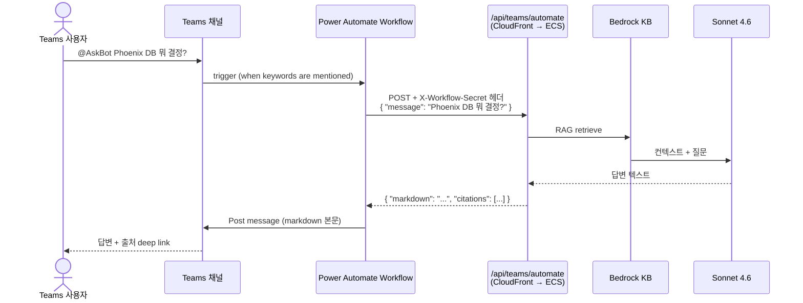

# Teams + Power Automate Workflow 연동 가이드

> MS Office 365 Connectors (Outgoing Webhook) 폐기 후 권장되는 대체 경로.
> Power Automate Workflow 가 Teams 메시지를 받아 챗봇 backend `/api/teams/automate` 로 전달하고, 응답을 Teams 채널에 다시 게시한다.

---

## 작동 흐름



---

## 사전 준비

- [x] 백엔드 endpoint: `https://dmap39ge1p529.cloudfront.net/api/teams/automate` (배포 완료)
- [x] 비밀키: SSM SecureString `/teams-bedrock-chatbot/automate-secret` (저장 완료)
- [ ] Power Automate **Premium** 라이선스 — HTTP 커넥터 사용에 필요. 본인 M365 플랜에 포함 여부 확인. Microsoft 365 E3/E5, Business Premium 은 보통 포함.

비밀키 확인 방법 (본인 터미널에서):

```bash
aws ssm get-parameter --region us-west-2 \
  --name /teams-bedrock-chatbot/automate-secret \
  --with-decryption --query Parameter.Value --output text
```

→ 출력값을 Power Automate HTTP 액션의 `X-Workflow-Secret` 헤더 값으로 사용. (외부 노출 금지)

---

## 1. Power Automate 에서 Flow 생성

1. <https://make.powerautomate.com> 접속
2. 좌측 **"Create"** → **"Automated cloud flow"**
3. **Flow name**: `Teams AskBot` (또는 원하는 이름)
4. **Choose your flow's trigger** 에서 검색: `When keywords are mentioned`
   - 정확한 이름: **"When keywords are mentioned" (Microsoft Teams)**
5. **Create** → 트리거 카드가 표시됨

### Trigger 설정

| 필드 | 값 |
|---|---|
| Group Type | Teams |
| Team | (대상 팀 선택, 예: `hhs`) |
| Channel | (대상 채널 선택) |
| Keywords | `AskBot` (콤마로 여러 개 지정 가능: `AskBot,Q봇`) |

> 💡 Keywords 가 메시지에 포함되면 트리거 실행. `@AskBot` 으로 @mention 해도 텍스트에 키워드가 들어가므로 동작.

## 2. HTTP 액션 추가 (백엔드 호출)

1. 트리거 카드 아래 **`+ New step`**
2. 검색: **"HTTP"** (Premium 표시) → **"HTTP"** 액션 선택
3. 설정:

| 필드 | 값 |
|---|---|
| Method | `POST` |
| URI | `https://dmap39ge1p529.cloudfront.net/api/teams/automate` |
| Headers | (아래 표) |
| Body | (아래 JSON) |

**Headers** (Show advanced options → Headers 에 key/value 두 줄):

| Key | Value |
|---|---|
| `Content-Type` | `application/json` |
| `X-Workflow-Secret` | (SSM 에서 가져온 비밀키 붙여넣기) |

**Body** (JSON):

```json
{
  "message": "@{triggerOutputs()?['body/plainTextMessage']}"
}
```

> `@{...}` 부분은 동적 콘텐츠로 트리거의 `Plain text message` 값을 참조. UI에서 "Add dynamic content" → "Plain text message" 클릭하면 자동 삽입.

## 3. 응답 파싱 (선택) 또는 직접 사용

가장 간단: HTTP 응답의 `markdown` 필드를 그대로 채널에 포스트.

1. **`+ New step`** → 검색: **"Post message in a chat or channel"** (Microsoft Teams)
2. 설정:

| 필드 | 값 |
|---|---|
| Post as | `Flow bot` (또는 사용자 본인) |
| Post in | `Channel` |
| Team | (트리거의 팀 dynamic content 사용 또는 동일 팀 선택) |
| Channel | (트리거의 채널 dynamic content 사용 또는 동일 채널) |
| Message | 아래 표현식 |

**Message** (HTML 모드로 전환 추천):

```
@{json(body('HTTP'))?['markdown']}
```

또는 Plain 모드:

```
@{body('HTTP')?['markdown']}
```

## 4. 저장 + 테스트

1. 우측 상단 **Save** 클릭
2. **Test** → **Manually** → **Test** → 채널로 가서 메시지 전송:
   ```
   @AskBot Phoenix DB 뭐 쓰기로 했어?
   ```
3. Power Automate Run History 에 새 실행이 보여야 정상. 채널에도 봇 응답 게시됨.

---

## 응답 예시

채널에 게시되는 메시지:

```
Phoenix 프로젝트 DB는 Aurora PostgreSQL 호환 버전을 사용하기로 확정되었습니다.

📎 출처 2개
- [프로젝트 Phoenix 개발팀 — 김민준](https://teams.microsoft.com/l/message/...)
- [프로젝트 Phoenix 개발팀 — 이서연](https://teams.microsoft.com/l/message/...)
```

---

## 트러블슈팅

| 증상 | 원인 / 해결 |
|---|---|
| HTTP 액션이 "Premium" 표시 + 사용 불가 | Power Automate Premium 라이선스 필요. M365 admin 확인 또는 trial 시작 |
| 401 응답 | `X-Workflow-Secret` 헤더 누락 또는 오타. SSM 값과 정확히 일치하는지 확인 |
| 500 + `KB_ID not found` | 백엔드의 SSM 접근 문제. AWS 콘솔에서 SSM 파라미터 확인 |
| Trigger 안 잡힘 | Keywords 정확한 일치. 대소문자/공백 확인. 채널 권한 확인 |
| 응답에 깨진 한글 | 헤더에 `Content-Type: application/json; charset=utf-8` 명시 |
| 채널에 메시지 안 보임 | "Post message" 액션의 Team/Channel 잘못 선택. trigger 의 dynamic content 사용 권장 |

## 비밀키 회전

운영 중 비밀키 노출 의심 시:

```bash
NEW_SECRET=$(openssl rand -base64 32)
aws ssm put-parameter --region us-west-2 \
  --name /teams-bedrock-chatbot/automate-secret \
  --type SecureString --value "$NEW_SECRET" --overwrite

# ECS task 재기동 (in-process 캐시 무효화 — 우리 코드는 매 요청 SSM 조회하지만 안전)
aws ecs update-service --region us-west-2 \
  --cluster teams-bedrock-chatbot --service teams-bedrock-chatbot-svc \
  --force-new-deployment
```

→ Power Automate Flow 에서 HTTP 액션의 `X-Workflow-Secret` 헤더 값을 새 비밀키로 업데이트.

---

## 다음 확장 아이디어

- **사용자별 권한 제어**: trigger 의 `from.email` 을 백엔드로 같이 보내 사용자별 KB 필터링
- **여러 채널 지원**: 각 채널마다 별도 Flow 또는 트리거 keywords 확장
- **AI Builder 가공**: Adaptive Card 로 풍부한 UX (응답을 사이트별 카드로 분리)
- **HTTP 응답 5xx 시 fallback 메시지** 액션 추가
